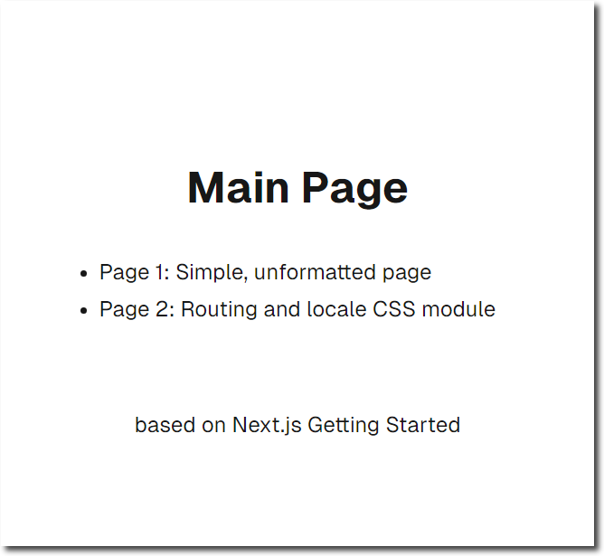
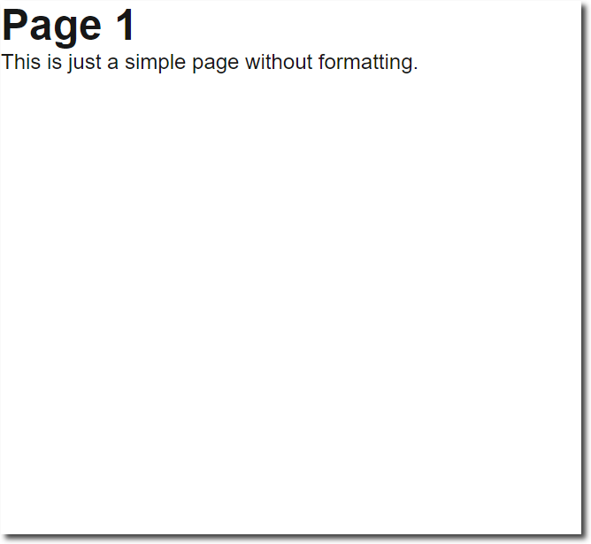
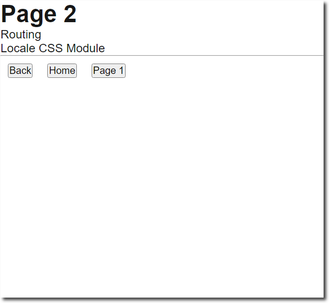

# Simple Next.js Getting Started React App

Just a simple project to take a look at [Next.js](https://nextjs.org). Based on the [Getting Started](https://nextjs.org/docs/app/getting-started/installation) app.

Run `npm run dev` and open http://localhost:3000.

|             |                     Version |
| ----------- | --------------------------: |
| **React**   | 19.0.0-rc-66855b96-20241106 |
| **Next.js** |                      15.0.3 |

|                   | Files | Total Files Size |
| ----------------- | ----: | ---------------: |
| **git clone**     |   122 |          0.65 MB |
| **npm install**   | 17427 |        371.15 MB |
| **npm run build** | 17531 |        414.27 MB |

